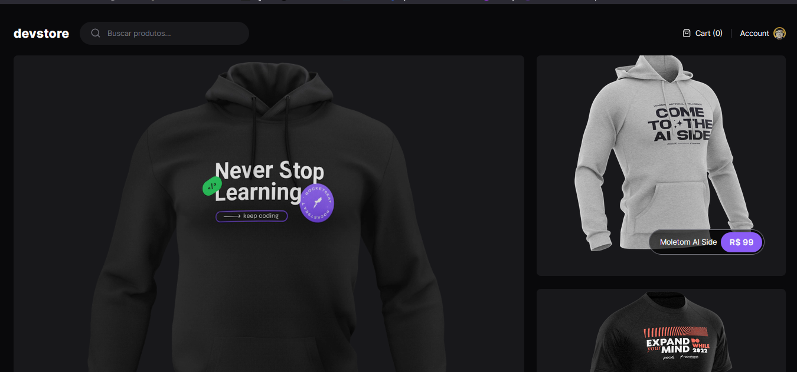

# DEVSTORE - ROCKETSEAT
Aplicação de Loja feito durante o Curso de NextJS App Router e Testes da Rocketseat

<h1 align="center">
  
</h1>

## 💻 Tecnologias Utilizadas nesse Projeto
<div style="display: inline_block">
  
  
  
  
</div>

<br>

## Especificações
- Node: 20
- Pacote de Gerenciamento de Dependências: PNPM
- Framework: React + NextJS

<br>

## Como instalar as dependências
```bash
$ pnpm install
```

## Rodar o Projeto
```bash
$ pnpm run dev
```

## Link do Deploy
https://rock-devstore-nextjs.vercel.app/